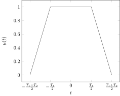
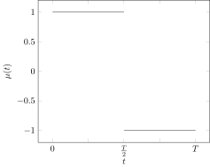
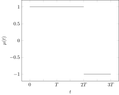

作业三
=========

1
-

求 $\beta_0, \delta$。



```matlab
% if you use matlab, please comment this line
pkg load symbolic;
syms t T1 T2 pi;
mu1 = 2/T2*(t + T1/2) + 1;
mu2 = sym(1);
mu3 = -2/T2*(t - T1/2) + 1;
_2E = simplify(...
    int(mu1^2, t, -(T1 + T2)/2, -T1/2) + ...
    int(mu2^2, t, -T1/2, T1/2) + ...
    int(mu3^2, t, T1/2, (T1 + T2)/2)...
);
beta = simplify(...
    sqrt(...
    1/_2E*(...
    int(diff(mu1, t)^2, t, -(T1 + T2)/2, -T1/2) + ...
    int(diff(mu2, t)^2, t, -T1/2, T1/2) + ...
    int(diff(mu3, t)^2, t, T1/2, (T1 + T2)/2)...
    )...
    )...
)
delta = simplify(...
    sqrt(...
    (2*pi)^2/_2E*(...
    int((t*mu1)^2, t, -(T1 + T2)/2, -T1/2) + ...
    int((t*mu2)^2, t, -T1/2, T1/2) + ...
    int((t*mu3)^2, t, T1/2, (T1 + T2)/2)...
    )...
    )...
)
latex(beta)
latex(delta)
```

$$\begin{aligned}
\beta_0 = & 2 \sqrt{3} \sqrt{\frac{1}{T_{2} \left(3 T_{1} + T_{2}\right)}}\\
\delta = & \frac{\sqrt{10} \sqrt{\frac{\pi^{2} \left(10 T_{1}^{3} + 10
T_{1}^{2} T_{2} + 5 T_{1 } T_{2}^{2} + T_{2}^{3}\right)}{3 T_{1} +
T_{2}}}}{10}
\end{aligned}$$

2
-

求 $W_\mathrm{e}, T_\mathrm{e}$。



```matlab
% if you use matlab, please comment this line
pkg load symbolic;
syms t T tau;
mu1 = sym(1);
mu2 = sym(-1);
Te = simplify(...
    (...
    int(mu1^2, t, 0, T/2) + ...
    int(mu2^2, t, T/2, T)...
    )^2/(...
    int(mu1^4, t, 0, T/2) + ...
    int(mu2^4, t, T/2, T)...
    )...
)
C1 = int(mu1*mu2, t, 0, T + tau);
C2 = int(mu1*mu1, t, 0, T/2 + tau) + int(mu1*mu2, t, T/2 + tau, T/2) + int(mu2*mu2, t, T/2, T + tau);
C3 = int(mu1*mu1, t, tau, T/2) + int(mu1*mu2, t, T/2, T/2 + tau) + int(mu2*mu2, t, T/2 + tau, T);
C4 = int(mu1*mu2, t, tau, T);
C0 = subs(C2, tau, 0);
We = C0^2/(...
    int(C1^2, tau, -T, -T/2) + ...
    int(C2^2, tau, -T/2, 0) + ...
    int(C3^2, tau, 0, T/2) + ...
    int(C4^2, tau, T/2, T)...
)
latex(We)
latex(Te)
```

$$\begin{aligned}
W_\mathrm{e} = & \frac3T\\
T_\mathrm{e} = & T
\end{aligned}$$

3
-

求 $A_\mathrm{\tau}, W_\mathrm{e}, A_\mathrm{\xi}, T_\mathrm{e}$。



```matlab
% if you use matlab, please comment this line
pkg load symbolic;
syms t T tau;
mu1 = sym(1);
mu2 = sym(-1);
Te = simplify(...
    (...
    int(mu1^2, t, 0, 2*T) + ...
    int(mu2^2, t, 2*T, 3*T)...
    )^2/(...
    int(mu1^4, t, 0, 2*T) + ...
    int(mu2^4, t, 2*T, 3*T)...
    )...
)
Axi = 1/T
C1 = int(mu1*mu2, t, 0, 3*T + tau);
C2 = int(mu1*mu1, t, 0, 2*T + tau) + int(mu1*mu2, t, 2*T + tau, 3*T + tau);
C3 = int(mu1*mu1, t, 0, 2*T + tau) + int(mu1*mu2, t, 2*T + tau, 2*T) + int(mu2*mu2, t, 2*T, 3*T + tau);
C4 = int(mu1*mu1, t, tau, 2*T) + int(mu1*mu2, t, 2*T, 2*T + tau) + int(mu2*mu2, t, 2*T + tau, 3*T);
C5 = int(mu1*mu1, t, tau, 2*T) + int(mu1*mu2, t, 2*T, 3*T);
C6 = int(mu1*mu2, t, tau, 3*T);
C0 = subs(C3, tau, 0);
We = C0^2/(...
    int(C1^2, tau, -3*T, -2*T) + ...
    int(C2^2, tau, -2*T, -T) + ...
    int(C3^2, tau, -T, 0) + ...
    int(C4^2, tau, 0, T) + ...
    int(C5^2, tau, T, 2*T) + ...
    int(C6^2, tau, 2*T, 3*T)...
)
Atau = 1/We
latex(We)
latex(Te)
```

$$\begin{aligned}
A_\tau = & \frac{22T}{27}\\
W_\mathrm{e} = & \frac{27}{22T}\\
A_\xi = & \frac{1}{3T}\\
T_\mathrm{e} = & 3T
\end{aligned}$$
